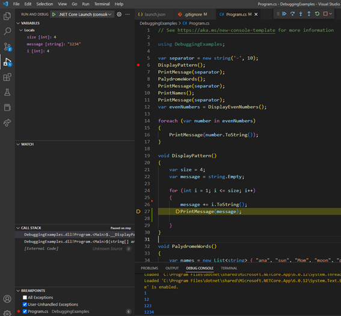
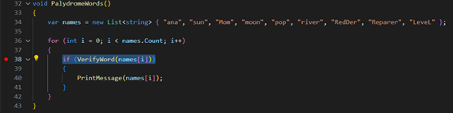
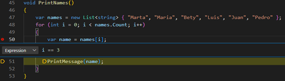
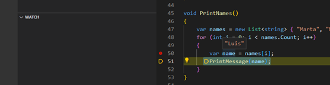
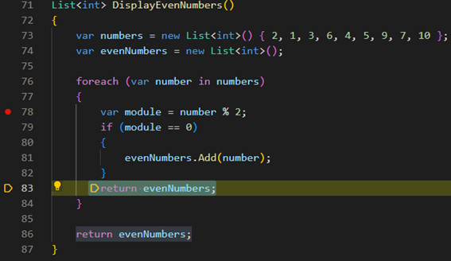

# tasks description for the practice
### solutions:
3. two lines were exchanged:
```c#
    message += i.ToString();
    PrintMessage(message);
```


---
4. 'toLower' method was added on the return line code
```c#
    return newWord.ToLower() == word.ToLower();
```


---
5. a conditional breakpouint was added, with the expresion 'i == 3'



---
6. a return line into foreach was commented. this was returning in ther first iteration from loop.

