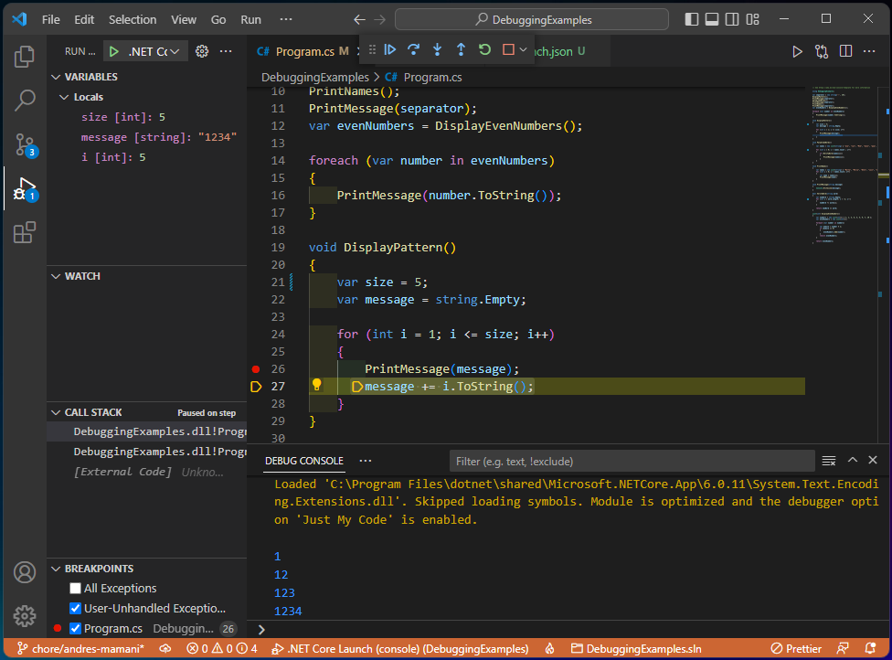
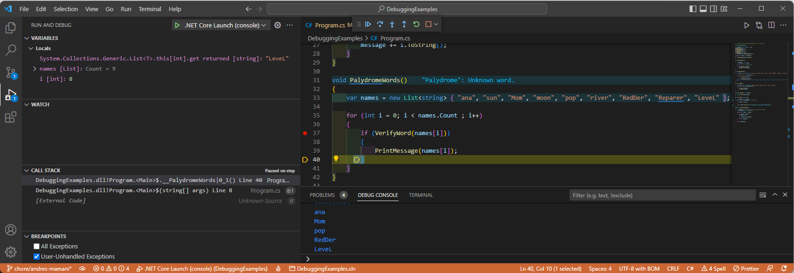
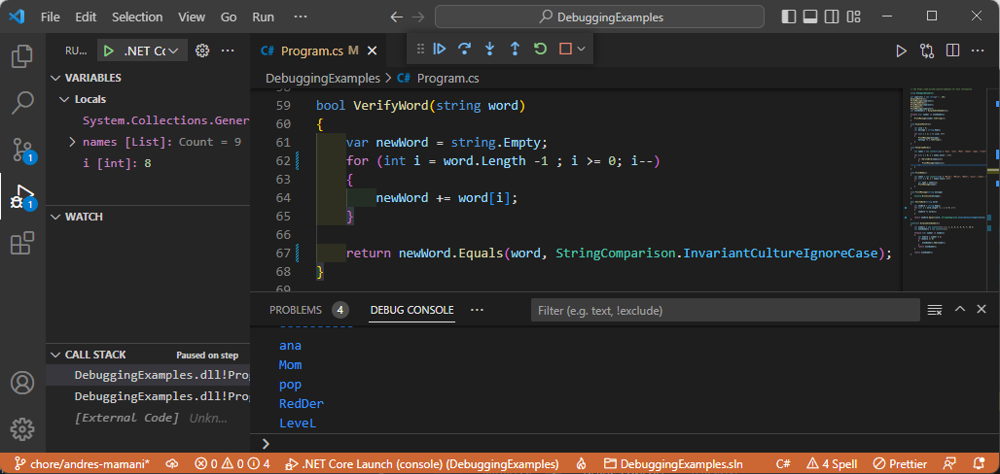
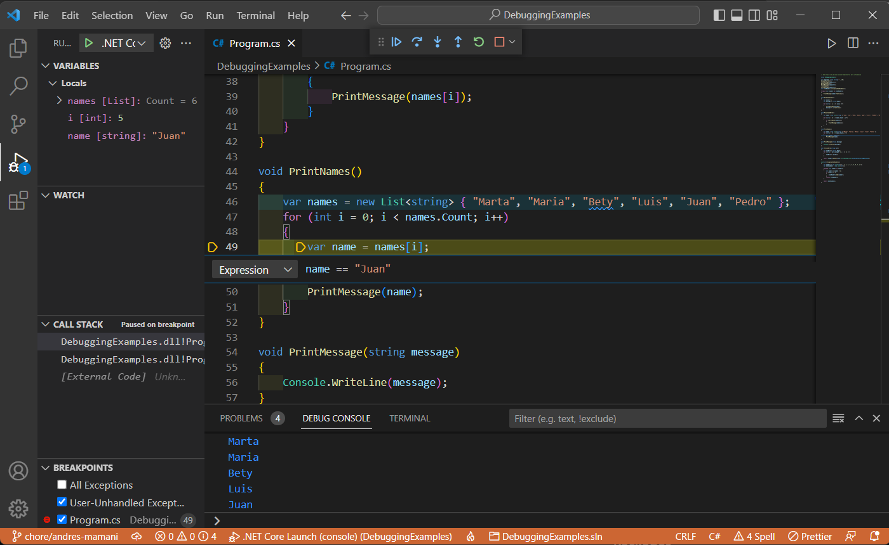
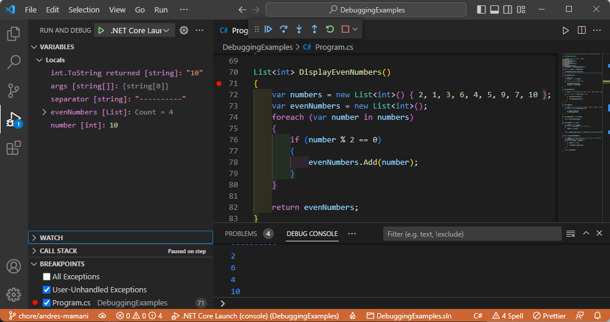

# Practice Solutions

## Requirements

1. For the first requirement, the **"size"** value was changed to **"5"** in the DisplayPattern method, so now the required value can be printed. **1 12 123 1234**

2. For the second requirement, The **"VerifyWord"** method was updated, ignoring uppercase and lowercase, so now the required value can be printed. **ana Mom pop RedDer Level**

3. For requirement 3, breakpoint was added when the **"name"** == **"Luis"**.

4. For the fourth request, the **"DisplayEvenNumbers"** method was updated so that it now prints the values of the request.

